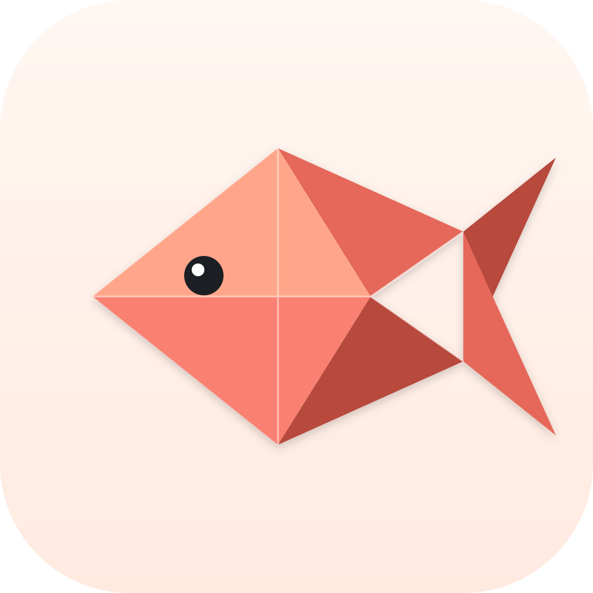

# SalmonApp

> An AI-first mail and workspace suite for Gmail / Outlook, calendar, contacts, tasks, and follow-up — Linux + macOS.
>
> SalmonApp turns your inbox into an AI workspace: it syncs mail locally, understands contacts and threads, extracts calendar events and tasks, and helps you act on what matters. AI runs through your locally logged-in `claude` or `codex` CLI, so no model API key or second AI account is required. See [Releases](https://github.com/pekinlcc/SalmonApp/releases) for the changelog.
>
> Note: deliberately named **SalmonApp** (one word) to avoid colliding with the bioinformatics `salmon` package on Linux distros.

<p align="center">
  
</p>

[中文 PRD](PRD.md) · [Mockup](mockup.html) · [Icon candidates](icon-candidates.html)

---

## Why

Most work still starts in email, but the action rarely stays there: a thread becomes a meeting, a follow-up task, a contact history, or context for an AI agent. Traditional mail clients show messages. SalmonApp tries to show the work hiding inside them.

The positioning is simple: **SalmonApp is an AI version of the personal work suite: smart mail first, then calendar, contacts, tasks, briefings, and local agents around it.**

Instead of treating mail, calendar, tasks, and AI chat as separate products, SalmonApp connects them:

- Mail from Gmail / Outlook, cached locally
- Calendar, contacts, and task views backed by the same connected accounts
- AI briefings that rank important threads and explain why they matter
- Event and task extraction from mail and conversations
- Contact-centric context, so related messages and suggested actions are visible together
- Optional coding Topics powered by Claude Code / Codex when the next action involves a project

The CLI-agent layer is still important, but it is infrastructure: SalmonApp does not call Anthropic or OpenAI model APIs itself. It runs the `claude` or `codex` CLI you already have logged in and uses that local agent capability for analysis and action.

## Product Surface

SalmonApp is organized like a local AI workspace suite:

| Area | What it does |
|---|---|
| **Mail** | Gmail / Outlook reader, sync, send, archive, read state, and local cache |
| **Contacts** | Unified contact view with related mail and AI-generated action context |
| **Calendar** | Calendar browsing and event creation from extracted dates or briefing actions |
| **Tasks** | Google / Microsoft task sync plus AI-suggested follow-ups |
| **Home / Briefing** | Summarizes what needs attention across mail, contacts, calendar, tasks, and Topics |
| **Topics** | Optional Claude Code / Codex sessions for project work and agent actions |

For project-heavy work, the optional Topic view keeps the original three-pane coding model:

| Pane | What it shows |
|---|---|
| **Left** | Topic list, grouped by recency, with engine + workdir badges |
| **Middle** | Markdown-rendered chat, tool-call cards, permission prompts, code blocks with `highlight.js` |
| **Right** | Tabs: Files (workdir tree) · Diff · Preview (MD / HTML / pptx / docx / xlsx) · Logs · ⛶ fullscreen toggle |

A **Topic** is mentally a *terminal tab pinned to a workdir* — open many at once, each with its own engine + persistent CLI session. Closing a Topic SIGTERMs its child PTY but keeps the CLI's transcript in `~/.claude/...` or `~/.codex/...` exactly as the CLI itself stores it. Re-opening lazily re-spawns via `claude --resume <session-id>` (or the Codex equivalent). Detach / attach, basically.

SalmonApp **does not** speak to Anthropic or OpenAI directly. It owns no model API key. Model credentials and session storage live with the CLI. Mail / calendar OAuth tokens are stored locally through the desktop app and are used only for the accounts you connect.

## Install

Grab the latest from [Releases](https://github.com/pekinlcc/SalmonApp/releases/latest).

### Ubuntu / Debian

```bash
# .deb — installs to /usr/bin/salmonapp and adds an application entry
sudo apt install ./SalmonApp_*.deb

# OR AppImage — no install, double-click or chmod +x then run
chmod +x SalmonApp_*.AppImage
./SalmonApp_*.AppImage
```

The `.deb` declares its WebKit / GTK runtime deps; `apt` resolves them. The AppImage bundles them.

### macOS (Apple Silicon + Intel, universal `.dmg`)

> ⚠ The Mac build is **not notarized** — this project has no Apple Developer account. The `.dmg` is signed ad-hoc, which is enough to launch but not enough to satisfy Gatekeeper out of the box. You'll see "Apple could not verify SalmonApp is free of malware" on first launch.

```bash
# 1. Open the .dmg, drag SalmonApp.app into /Applications
# 2. Tell Gatekeeper to trust it. EITHER:

# (a) Right-click SalmonApp.app → Open → click "Open" in the dialog. macOS
#     remembers the choice; subsequent launches are normal.

# OR (b) clear the quarantine bit from a terminal:
xattr -dr com.apple.quarantine /Applications/SalmonApp.app
```

`(b)` is the smoother path if you trust this repo's release pipeline. The `.dmg` is universal (`arm64` + `x86_64`), so the same file works on M-series and Intel Macs.

SalmonApp needs `claude` or `codex` discoverable on PATH. On macOS, GUI apps don't inherit your shell's PATH — SalmonApp walks `$SHELL -ilc 'echo $PATH'` at startup to import it, plus probes `/opt/homebrew/bin`, `/usr/local/bin`, `~/.npm-global/bin`, `~/.bun/bin`, etc. If `npm i -g @anthropic-ai/claude-code` worked in your terminal, it'll be found.

### Prerequisites

You need at least one of the CLIs already installed and logged in:

```bash
# Claude Code CLI
npm i -g @anthropic-ai/claude-code
claude   # follow the auth flow once

# OR Codex CLI
npm i -g @openai/codex-cli
codex    # auth flow
```

SalmonApp detects whichever is on `PATH` and offers to use them per-Topic.

Mail, calendar, contacts, and tasks are optional. To use them, configure Google / Microsoft OAuth once; see [OAUTH-SETUP.md](OAUTH-SETUP.md).

### Optional: Office document preview

The Preview pane renders `.pptx` / `.docx` / `.xlsx` / `.odp` / `.odt` / `.ods` by shelling out to LibreOffice headless and slicing the resulting PDF with `pdftoppm`. Install once:

```bash
# Linux
sudo apt install libreoffice-impress libreoffice-writer libreoffice-calc poppler-utils

# macOS (either of these)
brew install --cask libreoffice && brew install poppler
# or download LibreOffice.app from libreoffice.org/download/ — SalmonApp
# probes /Applications/LibreOffice.app/Contents/MacOS/soffice automatically.
```

Without these, Office files fall back to a friendly "binary file" placeholder instead of crashing the preview.

## Build from source

Common: Rust toolchain (`rustup` 1.77+) and Node 20+.

### Ubuntu 22.04 / 24.04

```bash
sudo apt install \
    libwebkit2gtk-4.1-dev libssl-dev libayatana-appindicator3-dev \
    librsvg2-dev build-essential curl wget file pkg-config

cd salmon
npm install
npm run tauri:build       # → src-tauri/target/release/bundle/{deb,appimage}/
```

### macOS

```bash
xcode-select --install      # if you don't have command-line tools yet
rustup target add aarch64-apple-darwin x86_64-apple-darwin

cd salmon
npm install
npm run tauri:build -- --target universal-apple-darwin
# → src-tauri/target/universal-apple-darwin/release/bundle/{macos,dmg}/
```

For native-arch only (faster build, won't run on the other Mac arch):

```bash
npm run tauri:build       # → src-tauri/target/release/bundle/{macos,dmg}/
```

### Development (hot-reload UI + auto-restart Tauri, all platforms)

```bash
npm run tauri:dev
```

## Architecture

```
salmon/
├── src/                    React + TypeScript UI (Vite)
│   ├── App.tsx                top-level layout, routing between workspace views
│   ├── components/
│   │   ├── LeftSidebar.tsx       Topic list, search, grouping
│   │   ├── BriefingFeed.tsx      Home briefing and suggested actions
│   │   ├── MailView.tsx          Gmail / Outlook mailbox
│   │   ├── CalendarView.tsx      Calendar view and event actions
│   │   ├── ContactsView.tsx      Unified contacts + related context
│   │   ├── TasksView.tsx         Task sync and follow-up workflow
│   │   ├── ChatStream.tsx        Markdown / tool-call rendering
│   │   ├── Composer.tsx          Input box, /-command pass-through
│   │   ├── ToolCallCard.tsx      Per-tool result rendering
│   │   ├── PermissionCard.tsx    Approval prompts (allow / deny)
│   │   ├── RightPane.tsx         Files / Diff / Preview / Logs tabs
│   │   ├── NewTopicDialog.tsx    Create-topic flow
│   │   └── Onboarding.tsx        First-run CLI detection
│   └── lib/                    invoke() wrappers + types
└── src-tauri/              Rust backend
    └── src/
        ├── lib.rs              Tauri builder, plugin wiring
        ├── commands.rs         Tauri commands invoked from React
        ├── engine.rs           PTY child management, JSONL parse loop
        ├── gmail.rs / graph.rs Gmail and Microsoft Graph integrations
        ├── briefing*.rs        Briefing orchestration and LLM analysis
        ├── calendar.rs         Calendar sync and actions
        ├── contacts.rs         Contact aggregation
        ├── tasks.rs            Task sync and actions
        ├── db.rs               SQLite schema + topic / message CRUD
        └── types.rs            Shared Rust ↔ TS types
```

Key choices:

- **Tauri 2** — native window, system WebKit, ~3 MB app vs. an Electron equivalent
- **Per-Topic PTY** — each Topic owns one `tokio::process::Child` running `claude` (or `codex`) in JSONL streaming mode. Stream events flow through an unbounded mpsc channel and out to the UI as Tauri events.
- **SQLite** in `~/.local/share/app.salmonapp.desktop/salmon.db` — Topics, messages, mail cache, contacts, events, tasks, briefings, permission decisions, token counts. Export / clear available from the UI where implemented.
- **Local-first model execution** — every model interaction is a child process invocation through `claude` or `codex`; SalmonApp does not call model APIs itself.

## Limitations

- Single window, single profile
- No cloud sync, no team workspace (out of scope per [PRD](PRD.md))
- Windows build not yet wired
- macOS build is unsigned / unnotarized — first launch needs the `xattr` workaround above
- Token-usage display only counts what the CLI emits in stream events
- Office preview blocks the UI thread for ~2-3 s on first render (LibreOffice cold-start); cached after
- Mail / calendar / contacts / tasks require user-provided OAuth client configuration for now

See [PRD.md](PRD.md) for the full design rationale and roadmap.
